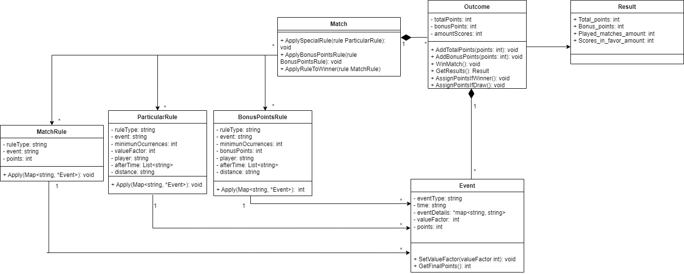

## Supuestos
* asumo que el criterio de posición es bonus points + points
* asumo una condition por regla
* el atributo after_time en las reglas es una lista siempre

## Diagrama


## Como correr el programa

Compilar por terminal desde la raiz
```bash
$ go build fifa-review
```

Para correr 
```bash
$./fifa-review --rules rule-list.json \
--match uruguay_vs_spain.json \
--match argentina_vs_spain.json \
--match uruguay_vs_argentina.json
```

## Como correr los tests

Desde la carpeta de test
```bash
$ go test
```
